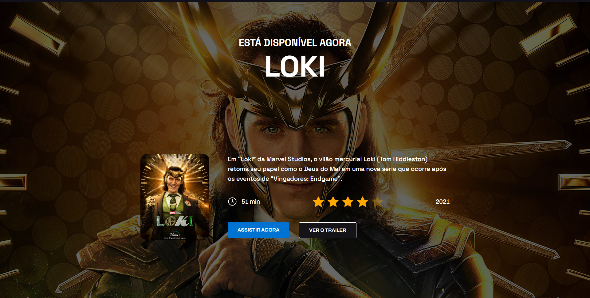

# Pagina de Divulgação Loki

## Descrição
Este projeto é uma aplicação web desenvolvida para oferecer uma solução para uma divulgação de forma simples para a serie Loki. Com uma interface intuitiva e amigável, os usuários serão redirecionados para o site da Disney ao interagir com a pagina. O projeto é uma ótima opção para divulgar a serie atraves de uma aplicação web simples.

## Demonstração

## Instalação
1. Clone este repositório: `git clone https://github.com/EltonKasesky/Pagina-Serie-Loki.git`
- Abra o arquivo `index.html` no seu navegador.

2. Abra o link abaixo, e veja o site hospedado na Vercel
- Link: [`Pagina Serie Loki`](https://pagina-serie-loki-kasesky.vercel.app)

## Funcionalidades
1. Responvidade
- Está aplicação web foi desenvolvida com arquitetura responsiva.

2. UI/UX Figma
- Foi utilizado a ferramenta figma para desenvolver o design deste site

3. Tecnologias utilizadas
- HTML
- CSS
- JavaScript

## Contribuindo
Contribuições são bem-vindas! Abra uma issue ou envie um pull request para sugerir melhorias, correções de bugs etc.

## Autor
- [Elton Giglio Kasesky](https://github.com/EltonKasesky)